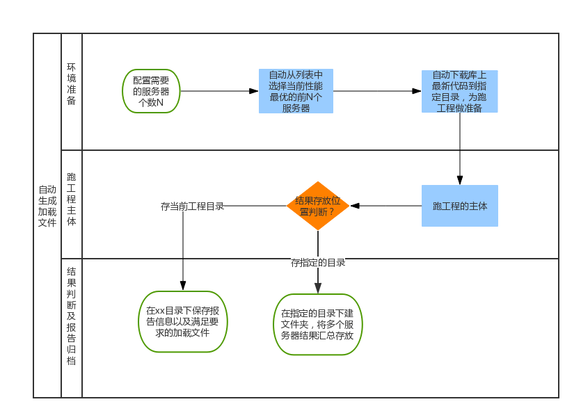

#自动生成加载文件的小系统搭建
小系统**功能描述**：提供工程源代码后，可以一键式的完成服务器的选择、工程编译、结果判断、报告信息保存以及自动选择满足项目要求的加载文件。
**（输入是：源代码；输出是：满足项目要求的加载文件）**

##痛点分析
当前整个跑工程的过程中有多个环节需要人为参与，并且由于项目的自身要求，每次跑工程时为了得到一个满足要求的加载文件，保险起见，需要4个人来备份完成，影响效率，且容易出错。
按照下面这个图，梳理下这个小系统搭建的过程。

##改进目的
- 释放人力，将这个操作由4人减少到1个人来完成。
- 将整个过程繁琐的操作分类，分步骤细化，用自动化的方式来实现。
- 可一键式生成满足项目要求的加载文件。
> 目的写完后，你要给自己打分，话术如下：“当看到这个目的的时候，会非常心动并想立刻开始做，那就打10分，否则 就是0分，你会为自己打几分？”如果平均分低于9分，这件 事就不要做了。

按照永澄老师的这个话术，我的答案是：9 10 10 。

##业务流程
整个的操作过程是知道的，但没有形成流程化的步骤，全靠自己的记忆来完成。

思路：
1. 梳理整个操作步骤，筛选选出认为参与的步骤，针对这些点做任务细分，每一个单独找方法解决。
2. 用自动化的方式将所有步骤串起来，策略上采取：借用、修改、自己编写三种组合的方式实现自动化的操作。
3. 输出对应的操作指导书，项目组内推广。
按照流程化、模块化的思想梳理整个操作过程，大致分了三类：**环境准备、跑工程的主体、结果判断以及收集报告，备份满足要求的加载文件**。

- **环境准备**：

    主要完成性能最优服务器的选择、代码的下载。
- **跑工程主体**：

    完成代码的编译、综合和布线等操作。
- **结果判断及报告归档**：

    1、判断工程的结果是否满足项目组的要求。

    2、根据配置，将满足要求的加载文件及报告信息归档存放在不同的目录下。

##工具体系
- 自动选择多个服务器：可以借用其他同事已有的成果，自己做修改适配。
- 对工程的结果判断，报告信息的文件归档，这些单步骤用shell脚本实现。
- 对整个流程用shell脚本全部自动化连起来。

##规则
- 尽量少的人为参与，根据不同的配置模式，可以自动完成所有操作。
- 灵活，可兼容现在跑工程的方式。
- 跑工程主体和报告的收集这两个大流程可以分别单独执行。
- 通用，整个流程可移植到其他项目上。

